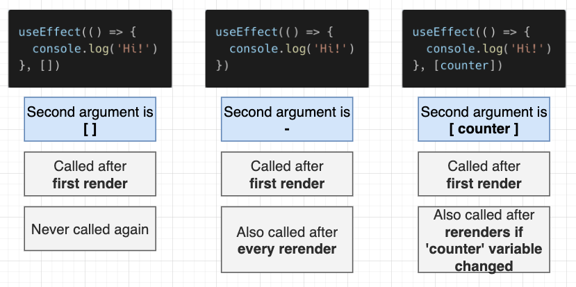

## `useState`

- `useState` allows a component to use the state system.

## `useEffect`

- `useEffect` allows a component to run code at specific points in time.
- Function that we import from React
- Used to run code when a component is initially rendered and (sometimes) when it is rerendered.

```js
useEffect(() => {
  console.log("hi!");
}, []);
```

- _First argument_ is a function that contains code we want to run.
- _Second argument_ is an array or nothing - this controls whether the function is executed on rerenders.
  

## `useContext`

- `useContext` allows a component to access values stored in context.
- `useContext` is used to consume a Context object created by the `createContext()` function.
- Context provides a way to pass data through the component tree without having to pass props down manually at every level.
- With `useContext`, we can access the data and functions that are passed through the context from any component within the tree, without the need to pass them explicitly through each level as props.

```js
// creating context
import { createContext } from "react";
const UserContext = React.createContext({ name: "", age: 0 });

// using context in a component
import { useContext } from "react";
function MyComponent() {
  const user = useContext(UserContext);
  return (
    <div>
      <h2>{user.name}</h2>
      <p>{user.age}</p>
    </div>
  );
}
```
